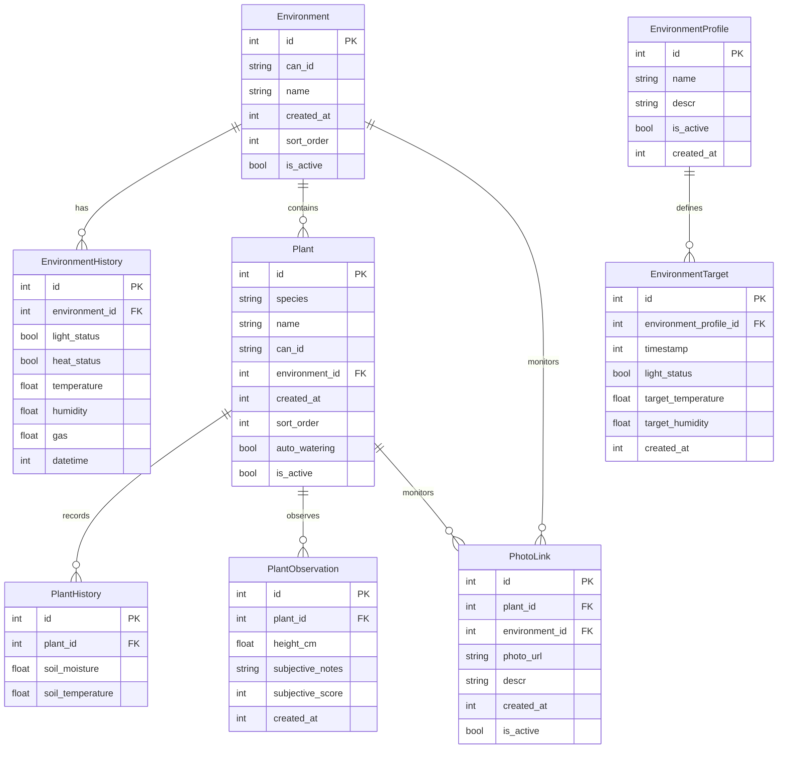

# Plant Monitoring System - Database Schema

## Entity Relationship Diagram

## Table Descriptions

### Environment Models

- **Environment**: Represents the physical growing space (room, tent, etc.)
- **EnvironmentProfile**: Reusable configuration templates for environment settings
- **EnvironmentHistory**: Time-series records of actual environmental conditions
- **EnvironmentTarget**: Scheduled target conditions linked to profiles

### Plant Models

- **Plant**: Individual plant monitoring nodes with sensors
- **PlantHistory**: Time-series sensor data for soil conditions
- **PlantObservation**: Manual observations and subjective assessments
- **PhotoLink**: IP camera references for environments or specific plants