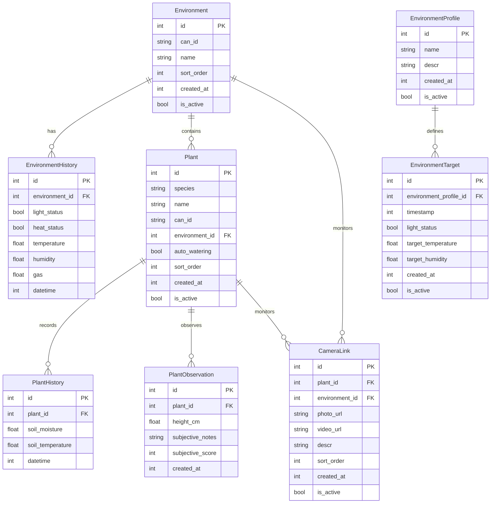

# Plant Monitoring System - Database Schema

## Entity Relationship Diagram

## Table Descriptions

### Base Fields
All tables with `created_at` and `is_active` inherit from `BaseTable`:
- **created_at**: Timestamp when the record was created
- **is_active**: Boolean flag for soft deletion/deactivation

### Environment Models

- **Environment**: Represents the physical growing space (room, tent, etc.)
  - Inherits: `created_at`, `is_active`
  
- **EnvironmentProfile**: Reusable configuration templates for environment settings (e.g., "Seedling", "Growth Stage")
  - Inherits: `created_at`, `is_active`
  
- **EnvironmentHistory**: Time-series records of actual environmental conditions
  - No inheritance - uses `datetime` field for timestamps
  
- **EnvironmentTarget**: Scheduled target conditions linked to profiles
  - Inherits: `created_at`, `is_active`

### Plant Models

- **Plant**: Individual plant monitoring nodes with sensors
  - Inherits: `created_at`, `is_active`
  
- **PlantHistory**: Time-series sensor data for soil conditions
  - No inheritance - uses `datetime` field for timestamps
  
- **PlantObservation**: Manual observations and subjective assessments
  - Uses `created_at` but doesn't inherit from BaseTable

### Miscellaneous

- **CameraLink**: IP camera references for environments or specific plants
  - Inherits: `created_at`, `is_active`
  - Supports both photo and video URLs