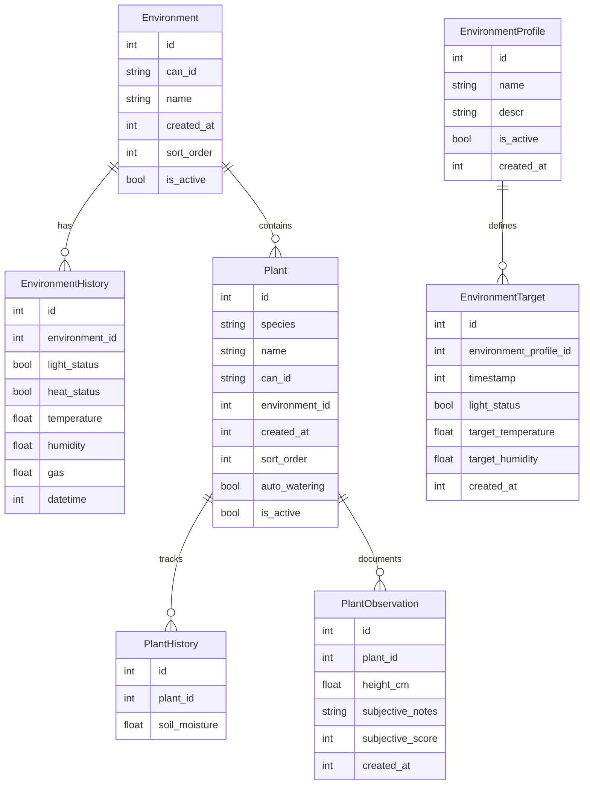

# Plant Monitoring Database Schema

## Database Diagram

## Table Details

### Environment
- **id**: Primary key
- **can_id**: Indexed, hardware integration identifier
- **environment_id** in EnvironmentHistory: Foreign key reference

### EnvironmentProfile
- **id**: Primary key
- **environment_profile_id** in EnvironmentTarget: Foreign key reference

### Plant
- **id**: Primary key
- **can_id**: Indexed, hardware integration identifier
- **environment_id**: Foreign key to Environment
- **plant_id** in PlantHistory and PlantObservation: Foreign key reference