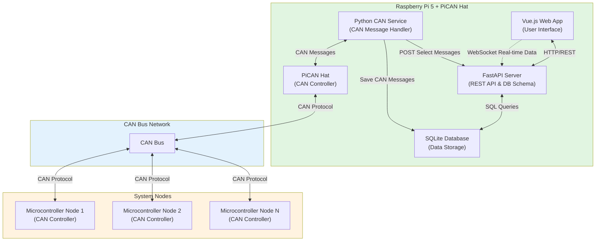

# System Architecture

AI Prompt:

```plaintext
Generate a Mermaid architecture diagram for the following system:

- Main server running on a Raspberry Pi 5 with PiCAN hat
	- FastAPI defines the database structure and handles data interaction with the web app
	- SQLite database stores the data
	- Vue.js app is the primary user interface for the system
	- A Python service sends and receives CAN bus messages to and from the nodes
		- The Python service sends select CAN messages to a FastAPI endpoint to be served to the UI via WebSockets
		- The Python service also saves some CAN messages to SQLite directly
- 1 or more System Nodes running on a microcontroller with a CAN bus controller
	- Sends and receives CAN bus messages to and from the main server
```

Claude Sonnet 4.5 output:


